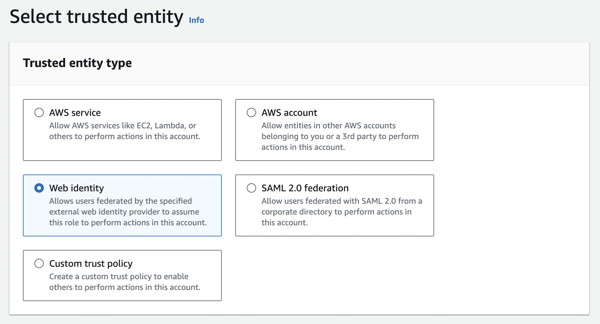
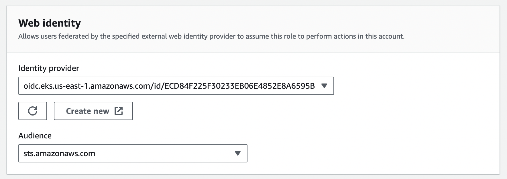
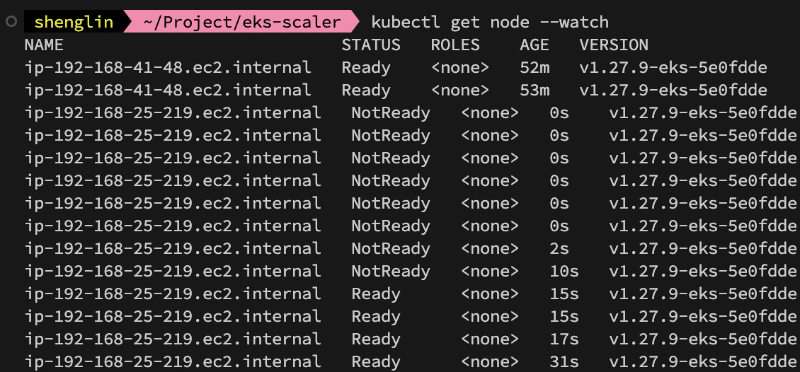
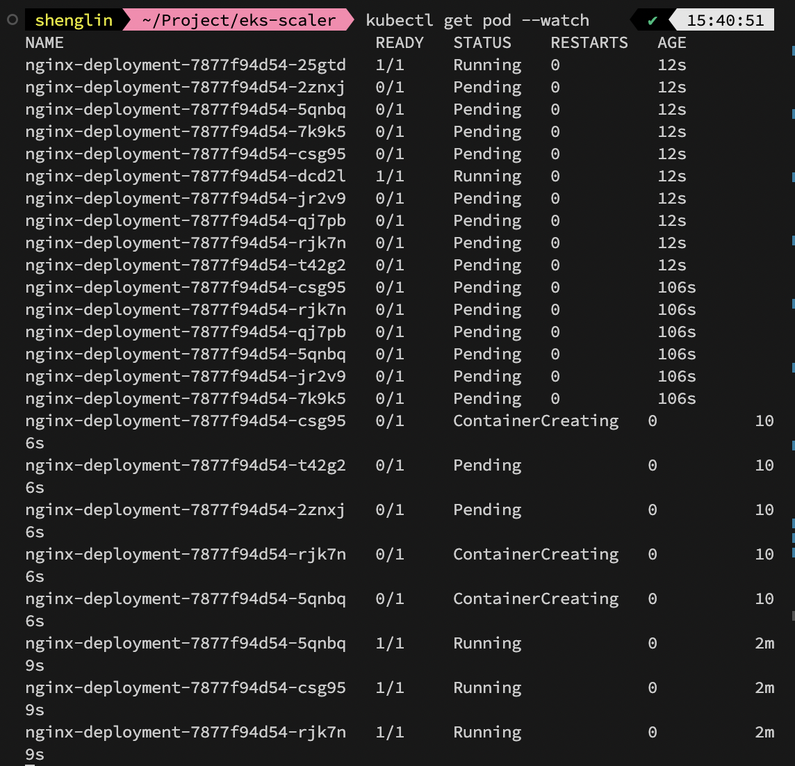
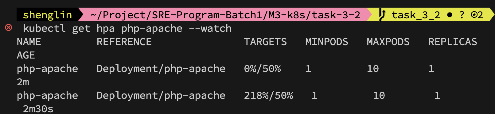
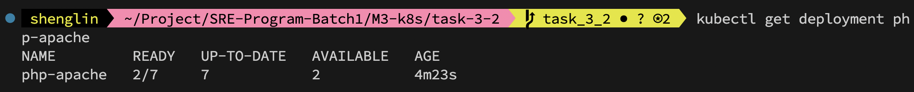
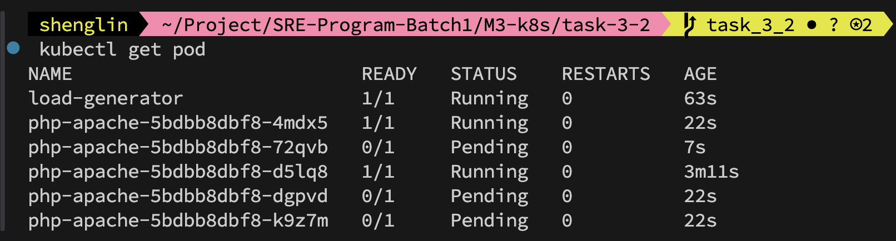

### CA

- 基於 eksctl 建立 cluster 環境。

```
---
apiVersion: eksctl.io/v1alpha5
kind: ClusterConfig
metadata:
  name: my-cluster
  region: us-east-1
managedNodeGroups:
- name: my-managed-node-group
  desiredCapacity: 1
  minSize: 1
  maxSize: 2
  instanceType: t2.small
availabilityZones:
- us-east-1a
- us-east-1b
```

- 建立 IAM Identiry provider(需要 provider URL，可以在 cluster 的頁面找到)

- 建立`AmazonEKSClusterAutoscalerPolicy`

```
{
    "Version": "2012-10-17",
    "Statement": [
        {
            "Effect": "Allow",
            "Action": [
                "autoscaling:DescribeAutoScalingGroups",
                "autoscaling:DescribeAutoScalingInstances",
                "autoscaling:DescribeLaunchConfigurations",
                "autoscaling:DescribeScalingActivities",
                "autoscaling:DescribeTags",
                "ec2:DescribeInstanceTypes",
                "ec2:DescribeLaunchTemplateVersions"
            ],
            "Resource": [
                "*"
            ]
        },
        {
            "Effect": "Allow",
            "Action": [
                "autoscaling:SetDesiredCapacity",
                "autoscaling:TerminateInstanceInAutoScalingGroup",
                "ec2:DescribeImages",
                "ec2:GetInstanceTypesFromInstanceRequirements",
                "eks:DescribeNodegroup"
            ],
            "Resource": [
                "*"
            ]
        }
    ]
}
```

- 建立`AmazonEKSClusterAutoscalerRole`，並且包含剛剛創建的 Policy
  
  

- 編輯`AmazonEKSClusterAutoscalerRole` 的 trust relationships，將 `aud` => `sub`，`sts.amazonaws.com` => `system:serviceaccount:kube-system:cluster-autoscaler`

```
{
    "Version": "2012-10-17",
    "Statement": [
        {
            "Effect": "Allow",
            "Principal": {
                "Federated": "arn:aws:iam::294396294515:oidc-provider/oidc.eks.us-east-1.amazonaws.com/id/ECD84F225F30233EB06E4852E8A6595B"
            },
            "Action": "sts:AssumeRoleWithWebIdentity",
            "Condition": {
                "StringEquals": {
                    "oidc.eks.us-east-1.amazonaws.com/id/ECD84F225F30233EB06E4852E8A6595B:sub": "system:serviceaccount:kube-system:cluster-autoscaler"
                }
            }
        }
    ]
}
```

- 執行 autoscaler 官方範例，在 service account 內設定綁定的 iam role，並且設定 cluster name。（注意 image 版本要符合 cluster 版本）

- 測試 CA，使用以下 deployment，replicas 設為 10，並且設定 resource 需求，資源不足後，可以看到 CA 進行 scale up。

```
apiVersion: apps/v1
kind: Deployment
metadata:
  name: nginx-deployment
spec:
  replicas: 10
  selector:
    matchLabels:
      app: nginx
  template:
    metadata:
      labels:
        app: nginx
    spec:
      containers:
        - name: nginx-container
          image: nginx
          ports:
            - containerPort: 80
          resources:
            requests:
              cpu: "0.2"
              memory: "256Mi"
```

```
---
apiVersion: v1
kind: ServiceAccount
metadata:
  labels:
    k8s-addon: cluster-autoscaler.addons.k8s.io
    k8s-app: cluster-autoscaler
  annotations:
    eks.amazonaws.com/role-arn: <role-arn>
  name: cluster-autoscaler
  namespace: kube-system
---
apiVersion: rbac.authorization.k8s.io/v1
kind: ClusterRole
metadata:
  name: cluster-autoscaler
  labels:
    k8s-addon: cluster-autoscaler.addons.k8s.io
    k8s-app: cluster-autoscaler
rules:
  - apiGroups: [""]
    resources: ["events", "endpoints"]
    verbs: ["create", "patch"]
  - apiGroups: [""]
    resources: ["pods/eviction"]
    verbs: ["create"]
  - apiGroups: [""]
    resources: ["pods/status"]
    verbs: ["update"]
  - apiGroups: [""]
    resources: ["endpoints"]
    resourceNames: ["cluster-autoscaler"]
    verbs: ["get", "update"]
  - apiGroups: [""]
    resources: ["nodes"]
    verbs: ["watch", "list", "get", "update"]
  - apiGroups: [""]
    resources:
      - "namespaces"
      - "pods"
      - "services"
      - "replicationcontrollers"
      - "persistentvolumeclaims"
      - "persistentvolumes"
    verbs: ["watch", "list", "get"]
  - apiGroups: ["extensions"]
    resources: ["replicasets", "daemonsets"]
    verbs: ["watch", "list", "get"]
  - apiGroups: ["policy"]
    resources: ["poddisruptionbudgets"]
    verbs: ["watch", "list"]
  - apiGroups: ["apps"]
    resources: ["statefulsets", "replicasets", "daemonsets"]
    verbs: ["watch", "list", "get"]
  - apiGroups: ["storage.k8s.io"]
    resources: ["storageclasses", "csinodes", "csidrivers", "csistoragecapacities"]
    verbs: ["watch", "list", "get"]
  - apiGroups: ["batch", "extensions"]
    resources: ["jobs"]
    verbs: ["get", "list", "watch", "patch"]
  - apiGroups: ["coordination.k8s.io"]
    resources: ["leases"]
    verbs: ["create"]
  - apiGroups: ["coordination.k8s.io"]
    resourceNames: ["cluster-autoscaler"]
    resources: ["leases"]
    verbs: ["get", "update"]
---
apiVersion: rbac.authorization.k8s.io/v1
kind: Role
metadata:
  name: cluster-autoscaler
  namespace: kube-system
  labels:
    k8s-addon: cluster-autoscaler.addons.k8s.io
    k8s-app: cluster-autoscaler
rules:
  - apiGroups: [""]
    resources: ["configmaps"]
    verbs: ["create", "list", "watch"]
  - apiGroups: [""]
    resources: ["configmaps"]
    resourceNames: ["cluster-autoscaler-status", "cluster-autoscaler-priority-expander"]
    verbs: ["delete", "get", "update", "watch"]

---
apiVersion: rbac.authorization.k8s.io/v1
kind: ClusterRoleBinding
metadata:
  name: cluster-autoscaler
  labels:
    k8s-addon: cluster-autoscaler.addons.k8s.io
    k8s-app: cluster-autoscaler
roleRef:
  apiGroup: rbac.authorization.k8s.io
  kind: ClusterRole
  name: cluster-autoscaler
subjects:
  - kind: ServiceAccount
    name: cluster-autoscaler
    namespace: kube-system

---
apiVersion: rbac.authorization.k8s.io/v1
kind: RoleBinding
metadata:
  name: cluster-autoscaler
  namespace: kube-system
  labels:
    k8s-addon: cluster-autoscaler.addons.k8s.io
    k8s-app: cluster-autoscaler
roleRef:
  apiGroup: rbac.authorization.k8s.io
  kind: Role
  name: cluster-autoscaler
subjects:
  - kind: ServiceAccount
    name: cluster-autoscaler
    namespace: kube-system

---
apiVersion: apps/v1
kind: Deployment
metadata:
  name: cluster-autoscaler
  namespace: kube-system
  labels:
    app: cluster-autoscaler
spec:
  replicas: 1
  selector:
    matchLabels:
      app: cluster-autoscaler
  template:
    metadata:
      labels:
        app: cluster-autoscaler
      annotations:
        prometheus.io/scrape: 'true'
        prometheus.io/port: '8085'
    spec:
      priorityClassName: system-cluster-critical
      securityContext:
        runAsNonRoot: true
        runAsUser: 65534
        fsGroup: 65534
        seccompProfile:
          type: RuntimeDefault
      serviceAccountName: cluster-autoscaler
      containers:
        - image: registry.k8s.io/autoscaling/cluster-autoscaler:v1.27.5
          name: cluster-autoscaler
          resources:
            limits:
              cpu: 100m
              memory: 600Mi
            requests:
              cpu: 100m
              memory: 600Mi
          command:
            - ./cluster-autoscaler
            - --v=4
            - --stderrthreshold=info
            - --cloud-provider=aws
            - --skip-nodes-with-local-storage=false
            - --expander=least-waste
            - --node-group-auto-discovery=asg:tag=k8s.io/cluster-autoscaler/enabled,k8s.io/cluster-autoscaler/<cluster-name>
          volumeMounts:
            - name: ssl-certs
              mountPath: /etc/ssl/certs/ca-certificates.crt # /etc/ssl/certs/ca-bundle.crt for Amazon Linux Worker Nodes
              readOnly: true
          imagePullPolicy: "Always"
          securityContext:
            allowPrivilegeEscalation: false
            capabilities:
              drop:
                - ALL
            readOnlyRootFilesystem: true
      volumes:
        - name: ssl-certs
          hostPath:
            path: "/etc/ssl/certs/ca-bundle.crt"
```




### HPA

- HPA 部分參照官方教程(https://kubernetes.io/zh-cn/docs/tasks/run-application/horizontal-pod-autoscale-walkthrough/)

- 環境使用同 CA 的 kubectl yaml 檔。

- 首先需要安裝 metric service(https://github.com/kubernetes-sigs/metrics-server#deployment)

- 建立以下資源：

```
apiVersion: apps/v1
kind: Deployment
metadata:
  name: php-apache
spec:
  selector:
    matchLabels:
      run: php-apache
  template:
    metadata:
      labels:
        run: php-apache
    spec:
      containers:
      - name: php-apache
        image: registry.k8s.io/hpa-example
        ports:
        - containerPort: 80
        resources:
          limits:
            cpu: 500m
          requests:
            cpu: 200m
---
apiVersion: v1
kind: Service
metadata:
  name: php-apache
  labels:
    run: php-apache
spec:
  ports:
  - port: 80
  selector:
    run: php-apache
```

- 創建 HorizontalPodAutoscaler

```
kubectl autoscale deployment php-apache --cpu-percent=50 --min=1 --max=10
```

HPA 做 scale out 的判斷，為根據 deployment 平均佔用的資源，依照 resource request 設定的比例，以這個範例來講，即為 200m \* 50% = 100m。

metric service 會去監控這個數字，並且進行 scale out。

- 執行以下，以增加 pod 負載

```
kubectl run -i --tty load-generator --rm --image=busybox:1.28 --restart=Never -- /bin/sh -c "while sleep 0.01; do wget -q -O- http://php-apache; done"
```

- 透過 `kubectl get hpa php-apache --watch` 監控，可以觀察到 hpa 顯示的監控結果。
  

- 觀察到 deployment 確實進行了擴展。
  
  
